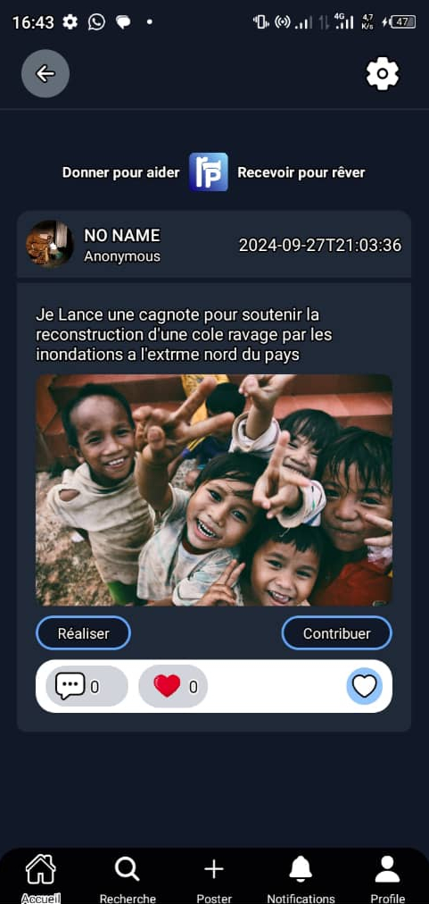
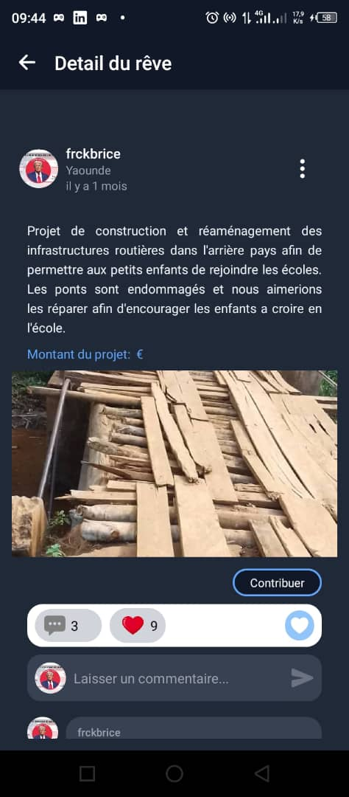

# Crowdfunding Mobile Platform

A modern **React Native (Expo)** mobile application for crowdfunding: creators post projects and seek funding; backers discover projects and contribute via donations (including PayPal).

### App preview (live screens)

| 1 | 2 | 3 | 4 | 5 | 6 | 7 |
|:---:|:---:|:---:|:---:|:---:|:---:|:---:|
|  |  |  |  |  |  |  |

---

## Features

- **Project discovery** — Browse and search crowdfunding projects (rêves/dreams)
- **Authentication** — Login, registration, password reset, secure token storage (Expo Secure Store)
- **Project creation** — Create and publish projects with images and documents
- **Contributions** — Donate to projects (e.g. PayPal integration)
- **Profile & settings** — User profile, favorites, account identification, preferences
- **Bilingual UI** — French and English message support

---

## Tech Stack

| Area | Technology |
|------|------------|
| Framework | [Expo](https://expo.dev) (SDK 51) |
| Runtime | React 18, React Native 0.74 |
| Language | TypeScript (strict) |
| Navigation | [Expo Router](https://docs.expo.dev/router/introduction/) (file-based) |
| Data & API | [TanStack Query (React Query)](https://tanstack.com/query/latest), Axios, Appwrite (optional backend) |
| Styling | [NativeWind](https://www.nativewind.dev/) (Tailwind for RN) |
| State | Zustand, React Context |
| Forms | React Hook Form |

---

## Project Structure (Modular Layout)

```
├── app/                    # Expo Router screens (file-based routing)
│   ├── _layout.tsx         # Root layout, fonts, auth redirect, Stack
│   ├── index.tsx           # Entry: auth check → home or onboarding
│   ├── (auth)/             # Auth group: login, register, onboarding, forgot-password
│   ├── (tabulate)/         # Main app: accueil, search, poster, profile
│   ├── (settings)/         # Settings group: edit-profile, parameters, etc.
│   ├── post/[id].tsx       # Project detail
│   ├── contribute/[idPub].tsx
│   └── reset-password.tsx
├── components/             # Reusable UI and feature components
│   ├── don/                # Donation (PayPal, form)
│   ├── profile/            # Profile-related (header, tabs, post-card, comments)
│   ├── publication/        # Publication (post, comments, document viewer)
│   ├── navigation/
│   └── ...                 # Buttons, headers, form fields, toasts, etc.
├── constants/              # App constants, theme, assets refs
│   ├── Colors.ts
│   ├── constants.ts        # API URLs, env, i18n messages
│   ├── icons.ts
│   ├── images.ts
│   └── index.ts
├── context/                # React Context providers
│   ├── global-provider.tsx
│   └── user-inactivity.tsx
├── hooks/                  # Custom hooks (auth, API, theme, queries)
├── lib/                    # Core logic: API client, types, React Query setup
├── store/                  # Persistence (e.g. MMKV, token cache)
├── utils/                  # Helpers (validation, errors, Supabase/PayPal)
├── assets/                 # Fonts, icons, images
├── app.json                # Expo config
├── eas.json                # EAS Build/Submit
└── package.json
```

This follows **Expo Router** and **React/React Native** best practices: feature-oriented components under `components/`, shared logic in `hooks/` and `lib/`, and a single `app/` tree for routes and layouts.

---

## Prerequisites

- **Node.js** 18+
- **Yarn** (or npm)
- **Expo CLI** / EAS CLI for builds
- **iOS**: Xcode (Mac), CocoaPods  
- **Android**: Android Studio, JDK 17

---

## Setup

### 1. Clone and install

```bash
git clone git@github.com:frckbrice/Crowdfunding-mobile-Platform.git
cd Crowdfunding-mobile-Platform
yarn install
```

### 2. Environment variables

Create a `.env` in the project root (see `.env.example`). Expo exposes variables prefixed with `EXPO_PUBLIC_` to the app.

**Required for API and auth:**

- `EXPO_PUBLIC_PROD_API_URL` — Backend API base URL  
- `EXPO_PUBLIC_JWT_SECRET_KEY` — JWT secret (or token key name) used for auth

**Optional (PayPal):**

- `EXPO_PUBLIC_PAYPAL_CLIENT_ID`  
- `EXPO_PUBLIC_PAYPAL_SECRET`  
- `EXPO_PUBLIC_PAYPAL_DONNATION_BUTTON_ID`

**Optional (Appwrite):**

- `EXPO_PUBLIC_APPWRITE_PLATFORM`  
- `EXPO_PUBLIC_APPWRITE_PROJECT_ID`  
- `EXPO_PUBLIC_APPWRITE_DATABASE_ID`  
- `EXPO_PUBLIC_APPWRITE_COLLECTION_ID`  
- `EXPO_PUBLIC_APPWRITE_STORAGE_ID`

Do not commit `.env`; use EAS Secrets or your CI env for production.

### 3. Run the app

**Development (Expo dev client):**

```bash
yarn start
# Then: press i (iOS) or a (Android), or scan QR with Expo Go if not using dev client
```

**iOS:**

```bash
yarn ios
```

**Android:**

```bash
yarn android
```

**Web (experimental):**

```bash
yarn web
```

---

## Scripts

| Script | Description |
|--------|-------------|
| `yarn start` | Start Expo with dev client |
| `yarn ios` | Run on iOS simulator/device |
| `yarn android` | Run on Android emulator/device |
| `yarn web` | Run in web browser |

---

## Building for production (EAS)

1. Install EAS CLI: `npm i -g eas-cli`
2. Log in: `eas login`
3. Configure env in EAS (Dashboard or `eas.json` env) for preview/production
4. Build:
   - **Preview (internal):** `eas build --profile preview --platform all`
   - **Production:** `eas build --profile production --platform all`

See `eas.json` for profile definitions and env mapping.

---

## Architecture notes

- **Routing**: Expo Router uses `app/` file system. Groups like `(auth)` and `(tabulate)` organize stacks/tabs without affecting the URL.
- **Auth**: Token is stored in Expo Secure Store. Root layout and `app/index.tsx` redirect authenticated users to `/(tabulate)/accueil` and unauthenticated to onboarding/auth.
- **API**: Centralized in `lib/api.ts`; TanStack Query in `hooks/` for server state. Use `@/` path alias (see `tsconfig.json`).
- **Modularity**: Keep screens thin; put business logic in `hooks/` and `lib/`, and reusable UI in `components/` (with subfolders per feature when useful).

---

## Contributing

1. Fork the repository  
2. Create a feature branch  
3. Make changes with TypeScript and existing patterns  
4. Run the app and test on a device/simulator  
5. Open a pull request

---

## License
MIT
